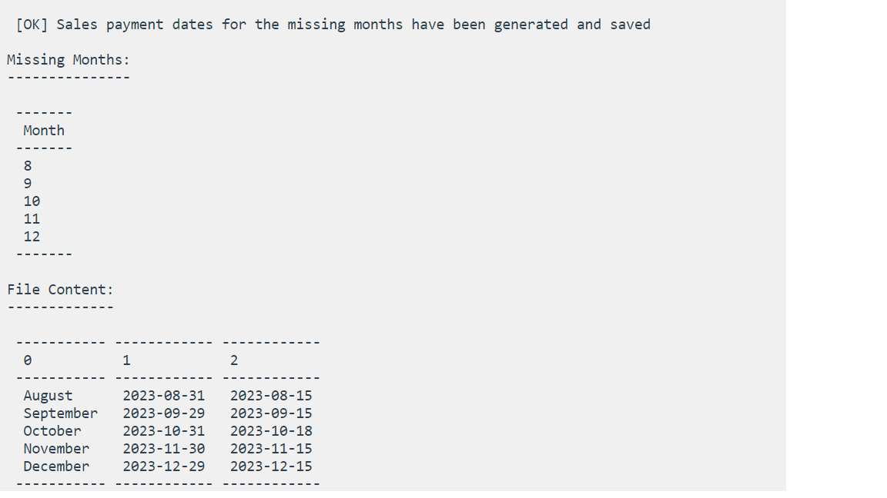

# Sales Payment Utility

This project provides a command-line utility and a web interface for generating sales payment dates. It combines Symfony and Vue.js to offer a comprehensive solution for managing sales payment dates.

## Frameworks Used

- **Symfony**: A PHP framework for building web applications.
- **Vue.js**: A JavaScript framework for building user interfaces.
- **Symfony Console Component**: Used for creating and running console commands.
- **Symfony Process Component**: Used for executing external processes from PHP.
- **Axios**: A JavaScript library for making HTTP requests from the browser.

## Getting Started

### Prerequisites

- PHP >= 8.0
- Composer: Dependency manager for PHP.
- Node.js: JavaScript runtime.
- npm or Yarn: Package managers for JavaScript.

### Installation

1. Clone the repository :

   ```bash
   git clone https://github.com/SaberZermani/sales_payment_utility-V1.git
   Navigate to the server-side folder and install backend dependencies using Composer:
    cd sales_payment_utility-V1/server-side
    composer install

2. Installation:

  Navigate to the client-side folder and install frontend dependencies using npm    or     Yarn:

    cd ../client-side/vue_js_app
    npm install
    # or
    yarn install

    Start the Symfony development server :

    (under server-side folder)
        symfony serve  
    
3. Start The Vue Js development server :

(under client-side/vue_js_app folder)

    npm run serve or yarn serve
    
    App running at:
  - Local:   http://localhost:8080/

# Usage :
    To generate sales payment dates using the command-line utility By UI :
     1. Access the web interface http://localhost:8080/
     2. Add Output File Path (e.g. csv_file directory is mandatory for this version, csv_file/OutPutPaymentDates.csv)
     3.Type Enter 
     Result :
     An interface will be displayed to say that :
        
        Months are already processed      
        The file does not exist 
        There are missing months (it will display the missing months and the complete list) and will update the file mentioned above.
    PS : Payments Calculation just for future Months of Actual Year (Version1)

## Screenshots




## Future Enhancements and Features

I have plans to enhance and expand the Sales Payment Utility in future versions. Here are some of the planned features and improvements:

### Version 2.0

#### 1. Database Integration
In the upcoming version, we plan to introduce database integration to store payment history. This will enable users to track payment data over time and provide a historical view of payments.

#### 2. Last Bonus Payment Calculation
To support calculating payments for the next year, I will introduce the capability to calculate payments for the next year's bonus as well. This will involve considering the 15th of January of the following year when calculating the bonus for December.


#### 3. User Authentication and Profiles
I envision adding user authentication and profile management, allowing users to have personalized experiences and access to their payment history.
